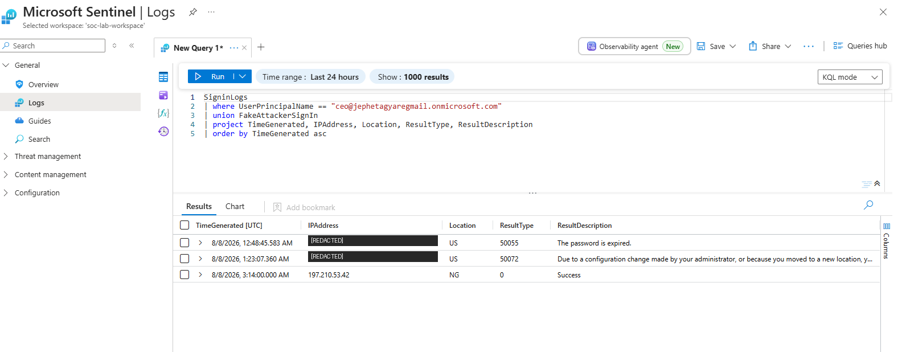

**Role simulated:** SOC Analyst
**Tools:** Microsoft Sentinel, Microsoft Entra ID, Log Analytics, KQL

## Overview

A CEO's account was reportedly accessed at 3:00 AM from Lagos, Nigeria — far outside their normal working hours and location. This project investigates the incident end-to-end using Microsoft Sentinel: detecting the anomaly, correlating identity data, mapping attacker behavior to MITRE ATT&CK, and executing containment.

## Environment Setup

- **Azure subscription:** dedicated personal tenant (required for full administrative control over Entra ID — Global Administrator or Security Administrator rights are needed to enable sign-in log export)
- **Resource group:** `soc-lab-rg`
- **Log Analytics Workspace:** `soc-lab-workspace` (region: East US 2)
- **Microsoft Sentinel:** enabled on top of the workspace

## Identity & Data Sources

- Provisioned a **Microsoft Entra ID P2** license to unlock sign-in log (`SigninLogs`) and audit log (`AuditLogs`) export — a P1/P2 license is required for this
- Installed the **Microsoft Entra ID** solution from the Sentinel Content Hub (73 analytics rule templates, 11 playbooks, 3 workbooks)
- Connected the **Microsoft Entra ID data connector**, enabling `SigninLogs` and `AuditLogs`
- Created a dedicated simulated **CEO user account** (`Alex Morgan`, `ceo@jephetagyaregmail.onmicrosoft.com`) in Entra ID as the victim identity
- Captured a legitimate baseline sign-in from this account, validating the full pipeline: Entra ID → Sentinel → Log Analytics

## Building the Attack Scenario

Real-world "impossible travel" scenarios are typically simulated in training environments using synthetic data, since replicating exact time/location/IP conditions via live network traffic isn't reliably controllable. This lab uses a KQL-based synthetic event, saved as a reusable Log Analytics function (`FakeAttackerSignIn`):

```kql
let FakeAttackerSignIn = datatable(TimeGenerated: datetime, UserPrincipalName: string, AppDisplayName: string, IPAddress: string, Location: string, ResultType: string, ResultDescription: string)
[
    datetime(2026-08-08T03:14:00Z), "ceo@jephetagyaregmail.onmicrosoft.com", "Azure Portal", "197.210.53.42", "NG", "0", "Success"
];
FakeAttackerSignIn
```

This function can be queried directly or unioned with the real `SigninLogs` table to build detection logic against a realistic anomaly, without requiring additional data ingestion infrastructure (Data Collection Rules/Endpoints).

## Detection: Analytics Rule

Deployed a **Scheduled query rule** in Sentinel: **"Impossible Travel - CEO Account."**

- **Severity:** High
- **MITRE ATT&CK tactics:** Initial Access, Credential Access, Defense Evasion
- **Detection logic (KQL):**
  ```kql
  FakeAttackerSignIn
  | where Location == "NG"
  | where ResultType == "0"
  ```
- **Query schedule:** runs every 1 hour, looks back 24 hours
- **Alert threshold:** triggers when query returns more than 0 results
- **Incident creation:** enabled — matching alerts automatically generate a Sentinel incident for triage

This rule isolates any successful sign-in originating from Nigeria against the CEO account — a location inconsistent with the account's established US-based baseline.

## Incident Triggered

The rule fired successfully, generating a live incident in the Microsoft Defender portal:

- **Incident:** Impossible Travel - CEO Account
- **Incident ID:** 1
- **Severity:** High
- **Category:** Credential access
- **Active alerts:** 1/1
- **Service source:** Microsoft Sentinel

This confirms the full detection pipeline works end-to-end: synthetic log data → analytics rule evaluation → real Sentinel/Defender incident generation.

## Investigation

Incident triaged in the Microsoft Defender portal: assigned to analyst, status moved to **In Progress**, classified as **True alert / Compromised account**.

**Correlating query** — joins the CEO account's real sign-in history with the synthetic attacker event to build a single timeline:

```kql
SigninLogs
| where UserPrincipalName == "ceo@jephetagyaregmail.onmicrosoft.com"
| union FakeAttackerSignIn
| project TimeGenerated, IPAddress, Location, ResultType, ResultDescription
| order by TimeGenerated asc
```


**Results:**

| Time (UTC) | IP Address | Location | ResultType | Description |
|---|---|---|---|---|
| 8/8/2026 12:48:45 AM | 2600:4040:af46:c600:... | US | 50055 | Password expired (first legitimate sign-in) |
| 8/8/2026 1:23:07 AM | 2600:4040:af46:c600:... | US | 50072 | Configuration/location change flagged |
| 8/8/2026 3:14:00 AM | 197.210.53.42 | **NG** | 0 | **Success — attacker sign-in** |

**Finding:** The CEO account authenticated legitimately from a US-based IP at 1:23 AM, then successfully authenticated again just **51 minutes later from Lagos, Nigeria** — a location change not physically achievable in that timeframe by any means of legitimate travel. This satisfies the classic "impossible travel" indicator used across SIEM/UEBA detections industry-wide.

### Incident Graph

After refining entity mapping on the analytics rule, the incident graph
correctly visualizes the relationship between the compromised account and
the attacker's IP address:


> **Note:** Incident IDs increment (1 → 4) across this investigation. This
> reflects multiple re-triggers of the `FakeAttackerSignIn` simulation while
> tuning entity mapping on the analytics rule — each incident represents the
> same underlying detection logic, not a separate finding.
>
> 

## MITRE ATT&CK Mapping

| Technique | ID | Tactic | Rationale |
|---|---|---|---|
| Valid Accounts | T1078 | Initial Access, Persistence, Defense Evasion | The attacker authenticated successfully using legitimate CEO credentials rather than exploiting a technical vulnerability, blending in with normal authentication traffic. |
| Multi-Factor Authentication Request Generation | T1621 | Credential Access | Not directly observed in this simulation, but flagged as a common follow-on technique to monitor for in a real impossible-travel scenario involving MFA-protected accounts. |

## Containment & Response

Response actions taken against the compromised account (`ceo@jephetagyaregmail.onmicrosoft.com`) directly in Microsoft Entra ID:

1. **Revoked all active sessions** — invalidated all refresh tokens for the account, forcing re-authentication across every device and session.
2. **Force password reset** — issued a new temporary password, retiring any credential the attacker may have obtained.

Recommended follow-up actions for a live incident (not required for this simulation):
- Enforce MFA on the account if not already required
- Review and tighten Conditional Access policies (e.g., block or challenge sign-ins from unexpected countries)
- Notify the account owner and security leadership
- Audit the account for downstream indicators of compromise: mailbox rules, OAuth application consents, privilege escalation attempts

## Resolution

Incident classified as **True Positive — Compromised Account**, status **In Progress**. All containment actions completed.
